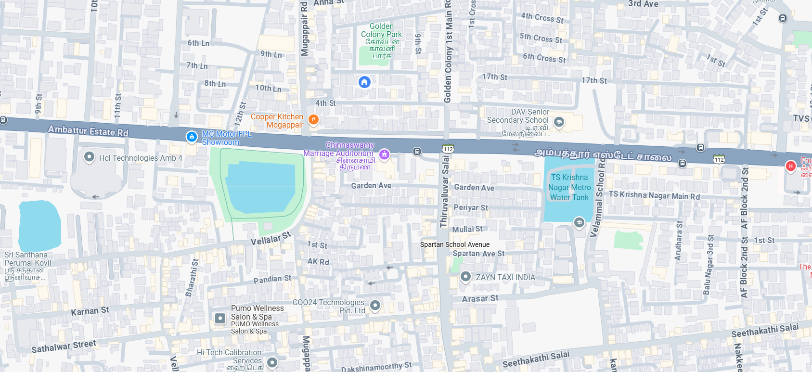

# Ex04 Places Around Me
## Date: 

## AIM
To develop a website to display details about the places around my house.

## DESIGN STEPS

### STEP 1
Create a Django admin interface.

### STEP 2
Download your city map from Google.

### STEP 3
Using ```<map>``` tag name the map.

### STEP 4
Create clickable regions in the image using ```<area>``` tag.

### STEP 5
Write HTML programs for all the regions identified.

### STEP 6
Execute the programs and publish them.

## CODE
```
<!DOCTYPE html>
<html>
<head>
<title>Simple Image Map</title>
<meta name="viewport" content="width=device-width, initial-scale=1.0">
</head>
<body>
<h2>Clickable Map Example</h2>
<p>Click any marked spot on the map to know about the place.</p>

<!-- Lock the image size -->


<map name="map">
   

 <area href="goldenpark.html" coords="700,100,737,51" shape="rect">
  <area shape="rect" coords="670,279,517,217" href="copper.html" alt="Copper Kitchen">
  <area shape="rect" coords="674,385,850,285" href="chinnaswamy.html" alt="Chinnaswamy Auditorium">
  <area shape="rect" coords="299,448,127,273" href="hcl.html" alt="HCL Technologies">
  <area  href="dav.html" coords="1211,298,1021,225" shape="rect">


  
</map>

</body>
</html>
```

## OUTPUT
 
 
 
 
 


## RESULT
The program for implementing image maps using HTML is executed successfully.
