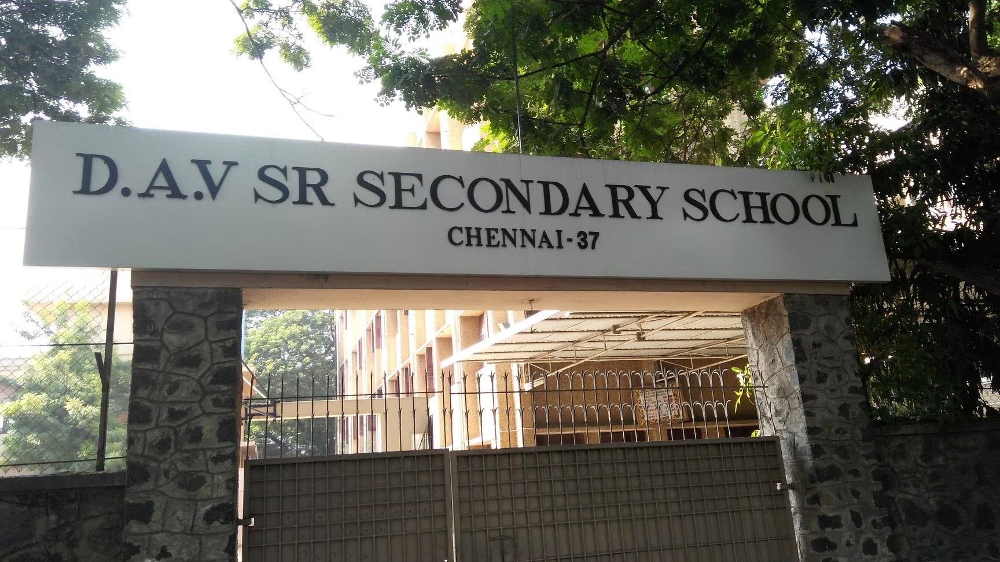

# Ex04 Places Around Me
## Date: 

## AIM
To develop a website to display details about the places around my house.

## DESIGN STEPS

### STEP 1
Create a Django admin interface.

### STEP 2
Download your city map from Google.

### STEP 3
Using ```<map>``` tag name the map.

### STEP 4
Create clickable regions in the image using ```<area>``` tag.

### STEP 5
Write HTML programs for all the regions identified.

### STEP 6
Execute the programs and publish them.

## CODE
### INDEX.HTML
```
<!DOCTYPE html>
<html>
<head>
<title>Simple Image Map</title>
<meta name="viewport" content="width=device-width, initial-scale=1.0">
</head>
<body>
<h2>Clickable Map Example</h2>
<p>Click any marked spot on the map to know about the place.</p>

<!-- Lock the image size -->


<map name="map">
   

 <area href="goldenpark.html" coords="700,100,737,51" shape="rect">
  <area shape="rect" coords="670,279,517,217" href="copper.html" alt="Copper Kitchen">
  <area shape="rect" coords="674,385,850,285" href="chinnaswamy.html" alt="Chinnaswamy Auditorium">
  <area shape="rect" coords="299,448,127,273" href="hcl.html" alt="HCL Technologies">
  <area  href="dav.html" coords="1211,298,1021,225" shape="rect">


  
</map>

</body>
</html>
```
### DAV.HTML
```
<!DOCTYPE html>
<html>
<head>
    <title>DAV School</title>
    <meta name="viewport" content="width=device-width, initial-scale=1.0">
    <style>
        body {
            text-align: center; /* centers content */
            font-family: Arial, sans-serif;
            margin: 50px;
        }
        img {
            max-width: 80%; /* keeps image responsive */
            height: auto;
            border: 2px solid black;
        }
        p {
            margin-top: 20px;
            font-size: 18px;
        }
    </style>
</head>
<body>

    <h2>DAV School</h2>

    <!-- Image of the place -->
    

    <!-- Description text -->
    <p>
        DAV School is a well-known educational institution in Mogappair. 
        It provides quality education and a safe environment for students to grow academically and personally.
    </p>

</body>
</html>
```
### COPPER.HTML
```
<!DOCTYPE html>
<html>
<head>
    <title>Copper Kitchen</title>
    <meta name="viewport" content="width=device-width, initial-scale=1.0">
    <style>
    body {
        text-align: center; /* centers everything */
        font-family: Arial, sans-serif;
        margin: 50px;
    }
    img {
        width: 70%;      /* image takes 90% of screen width */
        max-width: 1200px; /* optional max width */
        height: auto;     /* keeps aspect ratio */
        border: 2px solid black;
    }
    p {
        margin-top: 20px;
        font-size: 18px;
    }
</style>
</head>
<body>
    <h2>Copper Kitchen</h2>
    
    <p>
        Copper Kitchen is a popular restaurant in Mogappair known for its delicious meals, 
        cozy atmosphere, and friendly service.
    </p>
</body>
</html>
```
### GOLDENPARK.HTML
```
<!DOCTYPE html>
<html>
<head>
    <title>Golden Colony Park</title>
    <meta name="viewport" content="width=device-width, initial-scale=1.0">
     <style>
    body {
        text-align: center; /* centers everything */
        font-family: Arial, sans-serif;
        margin: 50px;
    }
    img {
        width: 70%;      /* image takes 90% of screen width */
        max-width: 1200px; /* optional max width */
        height: auto;     /* keeps aspect ratio */
        border: 2px solid black;
    }
    p {
        margin-top: 20px;
        font-size: 18px;
    }
</style>
</head>
<body>
    <h2>Golden Colony Park</h2>
    
    <p>
        Golden Colony Park is a beautiful community park in Mogappair, 
        perfect for morning walks, family outings, and enjoying nature.
    </p>
</body>
</html>
```
### HCL.HTML
```
<!DOCTYPE html>
<html>
<head>
    <title>HCL Technologies</title>
    <meta name="viewport" content="width=device-width, initial-scale=1.0">
     <style>
    body {
        text-align: center; /* centers everything */
        font-family: Arial, sans-serif;
        margin: 50px;
    }
    img {
        width: 70%;      /* image takes 90% of screen width */
        max-width: 1200px; /* optional max width */
        height: auto;     /* keeps aspect ratio */
        border: 2px solid black;
    }
    p {
        margin-top: 20px;
        font-size: 18px;
    }
</style>
</head>
<body>
    <h2>HCL Technologies</h2>
    
    <p>
        HCL Technologies is a leading IT company with a major campus in Mogappair, 
        providing technology solutions and career opportunities for thousands of employees.
    </p>
</body>
</html>
```
### CHINNASWAMY.HTML
```
<!DOCTYPE html>
<html>
<head>
    <title>Chinnaswamy Auditorium</title>
    <meta name="viewport" content="width=device-width, initial-scale=1.0">
    <style>
    body {
        text-align: center; /* centers everything */
        font-family: Arial, sans-serif;
        margin: 50px;
    }
    img {
        width: 70%;      /* image takes 90% of screen width */
        max-width: 1200px; /* optional max width */
        height: auto;     /* keeps aspect ratio */
        border: 2px solid black;
    }
    p {
        margin-top: 20px;
        font-size: 18px;
    }
</style>

</head>
<body>
    <h2>Chinnaswamy Auditorium</h2>
    
    <p>
        Chinnaswamy Auditorium is a major venue for cultural events, concerts, and community gatherings 
        in Mogappair, offering a spacious and well-equipped facility.
    </p>
</body>
</html>
```


## OUTPUT
     


## RESULT
The program for implementing image maps using HTML is executed successfully.
